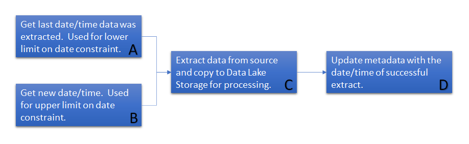
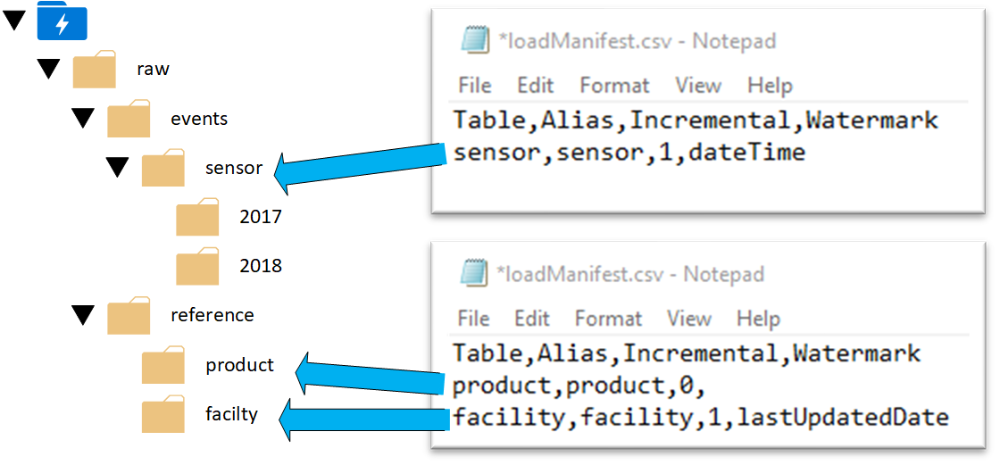

# data-factory-engine

## Index
- [Process Overview](#process-overview)  
- [Setup Instructions](#setup)  

## Process Overview

This entire project is based on the Incremental Copy tutorial found on Microsoft Docs
[https://docs.microsoft.com/en-us/azure/data-factory/tutorial-incremental-copy-overview](https://docs.microsoft.com/en-us/azure/data-factory/tutorial-incremental-copy-overview)  

This will walk you through the deployment of the Database code required to store and retrieve the dates to generate your dynamic date constraint in Data Factory.  To utilize the data factory ARM templates, please refer to this repository under the folder: **data-factory-templates**  
(../data-factory-templates/template-delta-copy-iterate-tables-sqlPaas.zip)  

### High Level Flow


Definition | Source | Name | Description | Parameters
:----: | :---- | :---- | :---- | :----
A | SQL Database | loader.up_GetLastWatermark | This stored procedure will pass in the schema name, table name, and Source System and then retrieve the last time the extract process last ran for this object to use as the lower limit for the dynamic date constraint when pulling data from the source database | @TableSchema, @TableName, @TableSchema
B | SQL Database | loader.up_GetNewWatermark | This stored procedure will return the current timestamp in UTC to use as the upper limit for the dynamic date constraint when pulling data from the source database | 
C | Data Factory | Extract-Files-to-Blob-Incremental | Incrementally pulling data from source database by creating dynamic date constraint using lower and upper dates as identified above
D | SQL Database | loader.up_UpdateLastWatermark | This stored procedure will pass in the last updated date, Table Schema, Table Name, if it was incrementally pulled and the source system so that we have record when the source object was last extracted. | @LastUpdatedDate, @TableSchema, @TableName, @Incremental, @SourceSystem

### Landing Zone
All raw data is landed in the raw storage container.  Each Source System will have a directory, with each underlying data subject area also having a directory.  The subject area will be partitioned by date with the following format: year/month/day/hour/minute.

Each source system should have a directory `_config` that contains a manifest file (`extractManifest.csv`) that records the data subject areas that are being extracted.  That file will contain the:
- Name of the table
- Alias of the table (if table needs a rename due to embedded / - like SAP and other source systems would have)
- Incremental (yes/no)
- Watermark: what field is used to identify the datetime for incremental extracts



#### Sample CSV Values
```csv
Schema,Table,Incremental,Watermark
dbo,product,0,
dbo,facility,1,lastUpdatedDate
```

 ******************************************** 

## Setup
The data factory engine is a PaaS based database solution that facilitates the incremental extraction of data, using data factory, but storing information about when the process last executed.

To deploy the database solution, you must first have an Azure SQL PaaS Server.  After that has been created:

1) Create a database on that PaaS server called *data-factory-engine*
2) [Set the Azure Active Directory Admin](../../documents/sql-server/how-to/set-active-directory-admin.md)
3) Open the solution file in the code repository called *data-factory-engine.sln*
4) Publish the solution, be sure to update the connection string to the correct server/database
5) [Update permissions](../../documents/sql-server/how-to/add-active-directory-users.md) on the ***data-factory-engine*** database.  You must login using your AAD account in order to complete these steps.
   
 ******************************************** 