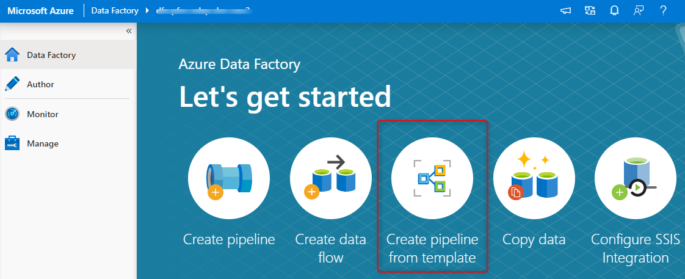
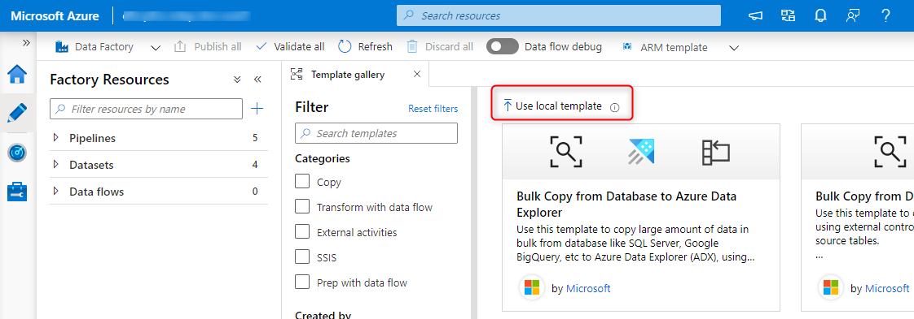
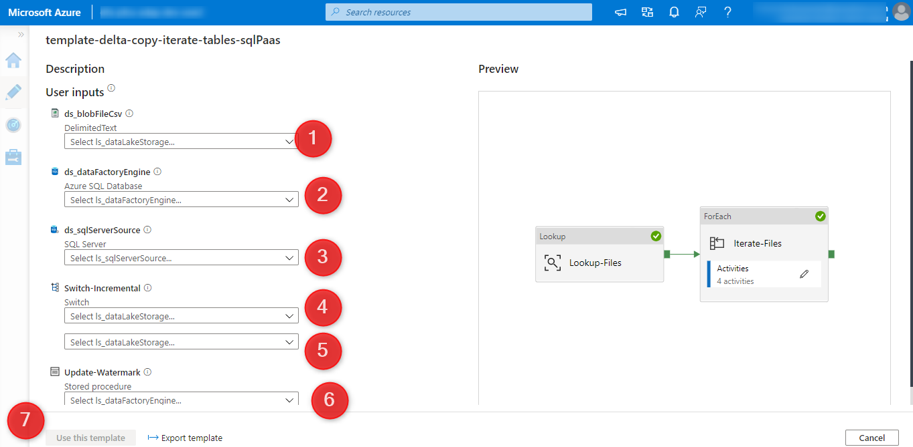
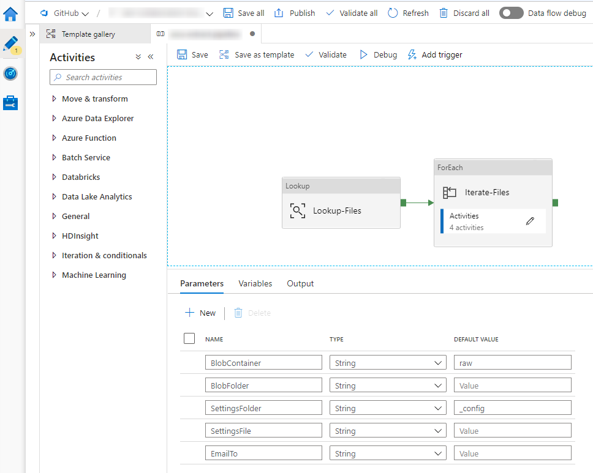

# Incremental Copy Azure Data Factory ARM Templates

## Index
- [Incremental Copy Azure Data Factory ARM Templates](#incremental-copy-azure-data-factory-arm-templates)
  - [Index](#index)
  - [Process Overview](#process-overview)
    - [High Level Flow](#high-level-flow)
    - [Assumptions](#assumptions)
  - [Import ARM Template](#import-arm-template)
    - [Setup](#setup)
  - [Post Deployment Configuration](#post-deployment-configuration)
    - [Pipeline Parameters](#pipeline-parameters)
    - [Failure Notification Pipeline Validation](#failure-notification-pipeline-validation)

## Process Overview
This entire project is based on the Incremental Copy tutorial found on Microsoft Docs
[https://docs.microsoft.com/en-us/azure/data-factory/tutorial-incremental-copy-overview](https://docs.microsoft.com/en-us/azure/data-factory/tutorial-incremental-copy-overview)  

This will walk you through the deployment of data factory ARM templates under the folder: **data-factory-templates**  
(../data-factory-templates/template-delta-copy-iterate-tables-sqlPaas.zip)  

### High Level Flow

### Assumptions
1) Data Factory has been deployed
2) You have access to Data Factory
3) You have deployed the database project: [data-factory-engine](../data-factory-engine/README.md)

## Import ARM Template
### Setup
Use the following steps to import the Azure Data Factory ARM Template
1.	Navigate to Azure Data Factory by using [portal.Azure.com](https://portal.azure.com) or by going to [adf.azure.com](https://adf.azure.com/)
2.	On the Let's get started page of Azure Data Factory UI, select the `Create pipeline from template` option from the middle pane.

3.	Select `Use local template` on the top pane

4.	Browse to the location of the ARM template.  In the repository for the ADAP platform the path should be: (code\data-factory-templates\template-delta-copy-iterate-tables-sqlPaas.zip)
5.  Complete the parameter values
    - **ds_blobFileCsv**: This is a generic Azure Data Lake data set.  If you do not have a Linked Service for Azure Data Lake, create a new one.  If one exists, select that Linked Service.  Typically: `ls_<storage-account-name>`.  Example: `ls_adlsquiadapdevusw2`
    - **ds_dataFactoryEngine**: This data set will reference the `data-factory-engine` created in previous steps.  Create a linked service: `ls_<sql-server-name>`.  Example: `ls_sqlquiadapdevusw2`
    - **ds_sqlServerSource**: This data set represents the source data that you will be moving.  Create a linked service for your source data.  Typically: `ls_<source-system-name>`.
    - **Switch-Incremental**: This would be the same Linked Service that was created/used in the **ds_blobFileCsv** parameter.
    - **Update-Watermark**: This would be the same Linked Service that was created/used in the **ds_sqlServerSource** parameter
    - Click: `Use this template`

 ******************************************** 

## Post Deployment Configuration
### Pipeline Parameters
You will now need to configure the parameters for your integration.  Here is the explanation of the Parameters and what the values should be:
- **BlobContainer**: This Blob container is in your Azure Data Lake Storage that you will be landing your data to.  Our guidance is to have a container called `raw` created.
- **BlobFolder**: This is a directory within the Blob Container above that you will be landing the data to.  There should be one folder for every source system.  Example:  If you are creating an integration for your CRM, create a directory called: `crm` and populate the parameter value with that directory name.
- **SettingsFolder**: default value would be `_config`.  This is where you will put the manifest of tables that you are extracting throughout this pipeline.  the `_config` directory will belong under the `crm` folder in this example.
- **SettingsFile**:  This is the filename for the manifest of tables that you are extracting throughout this pipeline.  Example: `extractManifest.csv`
- **EmailTo**: This would be the email or distribution list that you want to send failure notifications to.

### Failure Notification Pipeline Validation
Your Data Factory might have already been deployed with a pipeline called: `failure-notification-pipeline`.  The Incremental ARM Template also contains this pipeline and will have created a duplicate version of this pipeline.  If two instances exist, be sure to delete the newly deployed version of this pipeline and update your new pipeline to use the original istance of the `failure-notification-pipeline`.