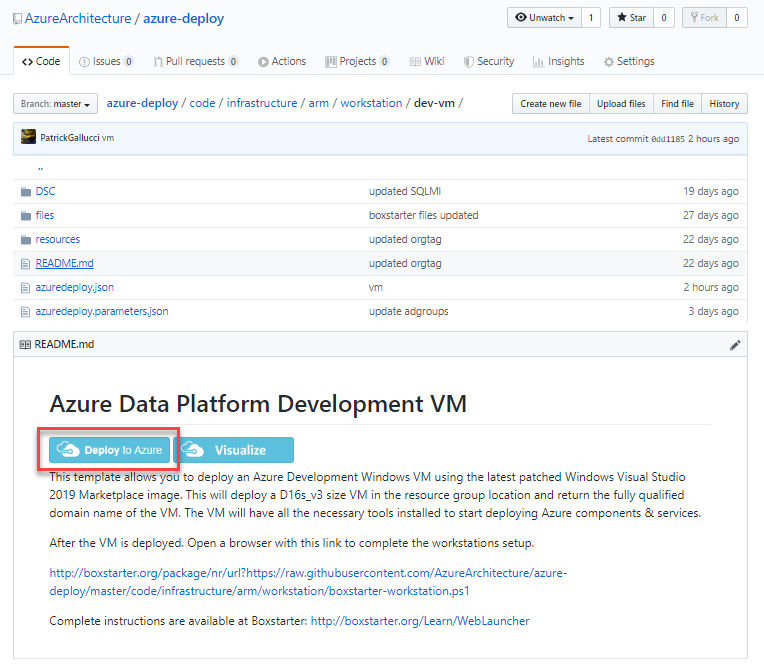

# Azure Deployment

This document will guide you through the steps to deploy the core scaffolding  in Azure. The deployment follows the prescriptive guidance found in the [Microsoft Cloud Adoption Framework](https://aka.ms/caf)

## Pre-requisites
In order to complete this deployment, you must have an [Azure Subscription](https://azure.microsoft.com/en-us/free/) with an Azure Active Directory Tenant.

### Create Azure Subscription
There are a few ways to provision an Azure Subscription. If you currently do not have an Azure Subscription, you should start here and learn about [Azure Subscriptions and Billing](https://docs.microsoft.com/en-us/azure/cost-management-billing/manage/). 
There are 6 primary ways of getting an Azure Subscription. 
1. **Microsoft Enterprise Customers** can secure a subscription through your Enterprise Agreement with Microsoft.
1. **Microsoft Cloud Solution Partner (CSP)** can help Organizations and Companies acquire a subscription.
1. **Microsoft Managed Solution Partner (MSP)** can help Organizations and Companies acquire a subscription.
1. **Individuals and Companies can acquire a Pay-As-You-Go Subscription** by supplying a credit card for Azure charges.
1. **Individuals are given an Azure Subscription with their MSDN Account** that provide $150 a month credit.
1. **[Free Azure Subscription](https://docs.microsoft.com/en-us/azure/cost-management-billing/manage/create-free-services)** with a $200 credit are available to anyone to try out Azure services.

` We will be using the free subscription for the remainder of this documentation and walkthroughs.`

### Create Azure DevOps Project
We will be leveraging an Azure DevOps project for workitem tracking, storing the our source code and for our CI/CD pipleines.

Go to the main [Azure DevOps web page](https://azure.microsoft.com/en-us/services/devops/?nav=min) and click on **Start Free**. For additional information on getting started with Azure DevOps visit the [Quickstart Azure DevOps documentation](https://docs.microsoft.com/en-us/azure/devops/user-guide/sign-up-invite-teammates?view=azure-devops). Login with the same credential that you used for your Azure Subscription. [Create a new organization](https://docs.microsoft.com/en-us/azure/devops/organizations/accounts/create-organization?toc=%2Fazure%2Fdevops%2Fget-started%2Ftoc.json&bc=%2Fazure%2Fdevops%2Fget-started%2Fbreadcrumb%2Ftoc.json&view=azure-devops) if one does not exist. [Create a new project](https://docs.microsoft.com/en-us/azure/devops/organizations/projects/create-project?view=azure-devops&tabs=preview-page) and name it **azure-deployment** or something that aligns with the deployment to Azure.

`NOTE: When creating the project Select "Private" and under Advanced, Select "Git" for the version control type and "Agile" for the work item process type.` 

### Create Deployment Workstation
In order to expidite the deployment, we will leverage a Windows 10 workstation that will have all the necessary tools and libriaries installed and configured. Go to https://tinyurl.com/dev-vm-azure and click **Deploy to Azure**. 

Navigate to the Azure Data Platform Development VM Github page: https://tinyurl.com/dev-vm-azure

You will complete this deployment with the information that is needed for the rest of the deployment activities. Please make note of the information here as it will be needed later in the deployment.

- **Subscription** Select the subscription that you will be deploying the rest of the platform to.  Example: Azure Subscription 1
- **Resource Group** Click Create New and create a new resource group that that will be used only for the deployment of this workstation. Example: rg-deploy-eus
- **Location** Select a location for the resource group. Example: (US) East US
- **Admin Username** The username of the VM Administrator that we are creating. Example: devAdmin
- **Admin Password** The password of the VM Administrator that we are creating. 
- **Base Name** 3-6 character string to make your VM workstation deployment unique.  Example: contoso
- **Rdp Port** TCP Port for remote desktop. Default is 3389. No need to change unless you have firewall or port restrictions.
- **Location** The Azure Region to deploy the VM. Example: eastus

`NOTE: The VM deployment should take about 15-20 minutes to complete.`

After the deployment is complete, Login to the VM with the credentials you supplied above. After you logon you will need to start the BoxStarter script to complete the installation of the developer tools on the vm. 

You will nee to open Internet Explorer and go to this url. This will launch the BoxStarter script. The VM will reboot a couple of times. You will need to wait about 2-3 minutes after it restarts the first time and login again and supply your admin password. This will allow it to continue the installation without you having to continue supplying your password.

http://boxstarter.org/package/nr/url?https://raw.githubusercontent.com/AzureArchitecture/azure-deploy/master/code/infrastructure/arm/workstation/boxstarter-workstation.ps1

`NOTE: You must use IE as Chrome and Firefox will not execute this script. `

## Deployment

After the pre-requisities have been completed an verified. You can follow the steps bellow to complete the deployment of the Azure Platform.

`Tags: Azure, Qusitive`
